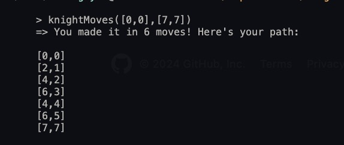

# Knight-travails

Shortest path between two tiles on a chessboard.

## Links

[Assignment link](https://www.theodinproject.com/lessons/javascript-knights-travails)

## Features

-

## Summary

Find the shortest possible route to get a knight piece from one square to another on a traditional 8x8 chessboard.

## Challenges

Starting off this assignment, I wasn't completely sure whether to implement the main functions mathematically (A knight moves two tiles forward and one tile to the side, which when given the current step should be able to compute the next one) - but that seems overkill for a 8x8 chessboard, and sometimes the shortest path is not the most straight-forward for this problem. Another method I had in mind was using an adjacency list ([based on this Khan Academy article](https://www.khanacademy.org/computing/computer-science/algorithms/graph-representation/a/representing-graphs)) but manually creating 64 arrays for each tile did not seem like the way to go at the time. In the middle of documenting my thoughts down however, I realized that both of these methods can be combined to dynamically create and push all the arrays into their respective lists.

With the chessboard tiles initiated and every tile getting filled with its' possible next moves in their respective adjacency lists, it took a bit of time to consider whichever search algorithm would work most effectively for the problem. A breadth-first-search seemed straightforward, but implementing such an algorithm in its most basic form does not seem like the most efficient method for computing the shortest path to a specific endpoint due to how the code would also check the direction opposite to your goal unless some if-case was provided.

After some reading and considerations, it didn't seem to be worth it to complicate the code and sacrifice readability for very negligent performance gain - especially on a chessboard that will never be more or less than a8x8 grid.

After a few days of idea-block and confusion-fueled frustrations, I was finally able to reach the end of the assignment and completed the main function of the code. I think the biggest struggle here was how to map out the path from start to end - finding the shortest path seemed simple enough. After some readings from others it seems that one of the common ways is using a parent Map() to pair nodes with their respective previous positions during the path-finding iteration (actually quite a few data structures were used for this project - a visited Set() to keep track of visited nodes so the code does not backtrack, a parent Map(), an adjacency list of neighboring nodes for all 64 tiles, and a queue array). Afterwards the parent Map() will be filled by all the visited nodes, but reconstructing the path is as simple as looking the end position's "parent" node and so on until the start is reached.

## Notes

Every movable tile for a knight is essentially just the given tile number plus / minus 2 or 1, with that in mind it's easier to visualize it's next option in a chessboard.
